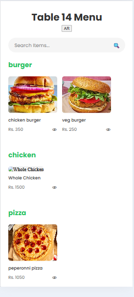
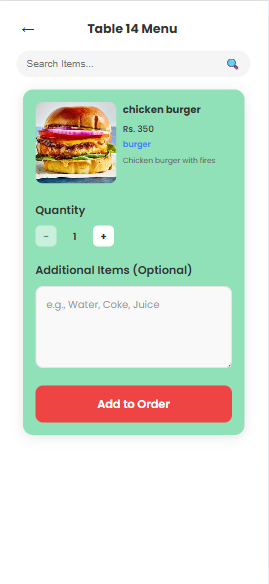
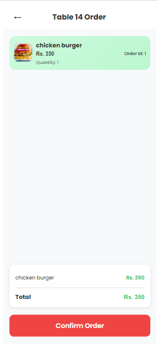
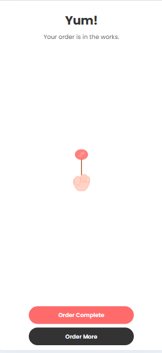

# 📱🍽️ AR Restaurant Menu

An Augmented Reality (AR) Restaurant Menu web application that allows users to view 3D models of dishes in AR through their mobile browsers. Built using **React**, **Node.js**, **AR.js**, and **Firebase**.

## 🚀 Features

- 📱 View interactive AR 3D models of menu items
- 🍔 Browse food items by categorye
- ☁️ Real-time data storage using Firebase Firestore
- 🌐 Responsive design for mobile and desktop

## 🛠️ Tech Stack

| Technology | Role |
|------------|------|
| React.js | Frontend UI |
| Node.js | Backend API |
| AR.js | Augmented Reality Integration |
| Firebase | Database |
| CSS | Responsive styling |

## 📸 Screenshots

### 🏠 Home Page

### 🧾 Order Page

### ✅ Confirm Order Page

### 🎉 Order Placed Page
